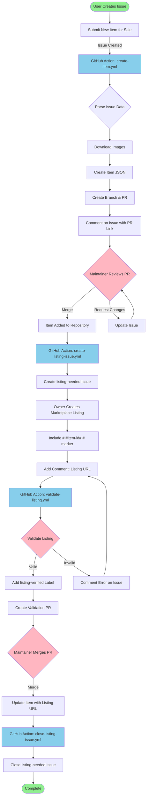

# Items for Sale

A repository for managing and listing items for sale.

## Directory Structure

- `items/` - JSON files containing item listings
- `images/` - Product images and media files
- `docs/` - Additional documentation
- `.github/ISSUE_TEMPLATE/` - GitHub issue templates
- `.github/workflows/` - GitHub Actions automation

## Item Schema

Each item listing should follow the schema defined in `docs/item-schema.json`. All text fields (title, description) must be provided in both English and Polish.

## Event Flow Diagram

## Usage

### Method 1: Submit via GitHub Issues (Recommended)

1. Click on the "Issues" tab in this repository
2. Click "New Issue"
3. Select "Submit New Item for Sale"
4. Fill out the form with your item details in both English and Polish
5. Submit the issue

**Automated Process:**

Once you submit the issue, a GitHub Action will automatically:
- Parse your submission and create a JSON file
- Create a new branch for the item
- Generate a Pull Request with the item details
- Comment on your issue with the PR link

The item will be added to the repository once the PR is reviewed and merged by a maintainer.

### Method 2: Direct Commit

1. Create a new JSON file in the `items/` directory
2. Follow the item schema template
3. Add corresponding images to the `images/` directory
4. Reference images using relative paths in the item listing

## Example

See `items/example-item.json` for a sample item listing.

## Currency

All items are priced in Polish Złoty (PLN) by default, but other currencies (EUR, USD, etc.) are also supported.

## Automation

This repository uses GitHub Actions with a GitHub App to automate the item submission process.

**Setup Required:**
- A GitHub App must be configured with appropriate permissions
- See `docs/github-app-setup.md` for detailed setup instructions

**Workflow:**

**Phase 1: Item Submission**
1. User submits an issue using the template
2. User uploads images or provides image URLs
3. GitHub Action validates and parses the issue
4. GitHub Action automatically downloads all images
5. A new branch is created with the item JSON file and images
6. A Pull Request is automatically generated
7. Maintainer reviews and merges the PR
8. Item becomes available in the repository

**Phase 2: Marketplace Listing**
9. GitHub Action creates a "listing-needed" issue
10. Owner creates marketplace listing
11. Owner must include marker `#!#item-id#!#` in listing description
12. Owner adds a comment with the listing URL
13. GitHub Action validates the listing (checks for marker)
14. GitHub Action updates the item with listing URL

See `docs/listing-workflow.md` for detailed information about the listing process.

**Labels:**
- `new-item` - Triggers item creation automation
- `pending-review` - Awaiting review
- `processed` - Automation completed successfully
- `listing-needed` - Item needs marketplace listing
- `listing-verified` - Listing URL has been validated

## Contributing

To submit a new item, please use the GitHub issue template. This ensures all required information is provided and maintains consistency across listings.
