# Workflow Diagrams

Visual representation of the automated workflows in this repository.

## Adding Items Workflow

This diagram shows the complete process from item submission to marketplace listing.

## Removing Items Workflow

This diagram shows the process for removing an item from the repository.

## Workflow States

### Item Creation States

1. **Issue Created** - User submits new item via issue template
2. **Parsing** - Workflow extracts item details and downloads images
3. **PR Created** - Automated PR with item JSON and images
4. **Under Review** - Maintainer reviews the PR
5. **Merged** - Item added to repository
6. **Listing Needed** - Tracking issue created for marketplace listing
7. **Listing Created** - Owner creates marketplace listing
8. **Validation** - System validates listing URL
9. **Complete** - Item fully listed and tracked

### Item Removal States

1. **Issue Created** - User submits removal request via issue template
2. **Validation** - Workflow checks if item exists
3. **PR Created** - Automated PR to delete item and images
4. **Under Review** - Maintainer reviews the PR
5. **Merged** - Item removed from repository
6. **Complete** - Issue closed automatically

## Validating Existing Listings Workflow

This diagram shows the automated nightly validation of marketplace listings.

```mermaid
flowchart TD
    Start([Scheduled: Nightly 2AM UTC]) --> A[Nightly - Validate All Listings]
    A --> B[Find All Items with status='listed']
    B --> C{For Each Item}

    C --> D[Fetch Listing URL]
    D --> E{Page Exists?}

    E -->|No - 404| F[Mark as Invalid]
    E -->|Yes| G{Marker Present?}

    G -->|No| F
    G -->|Yes| H[Listing Valid ✓]

    F --> I[Create listing-needed Issue]
    I --> J[Add listing-expired Label]
    J --> K[Update Item Status to 'available']
    K --> L[Remove Listing URL]

    H --> M{More Items?}
    L --> M

    M -->|Yes| C
    M -->|No| N{Any Invalid?}

    N -->|Yes| O[Create PR with Status Updates]
    N -->|No| P[All Listings Valid ✓]

    O --> Q[Add Comment with Details]
    Q --> R{Maintainer Reviews PR}
    R -->|Merge| S[Status Updates Applied]
    S --> End([Complete])

    P --> End

    style Start fill:#90EE90
    style End fill:#90EE90
    style A fill:#87CEEB
    style H fill:#90EE90
    style P fill:#90EE90
    style E fill:#FFB6C1
    style G fill:#FFB6C1
    style N fill:#FFB6C1
    style R fill:#FFB6C1
    style F fill:#FF6B6B
```

### Validation States

1. **Scheduled Run** - Workflow triggers at 2:00 AM UTC (or manually)
2. **Find Items** - Searches for all items with status "listed" and a listing URL
3. **Validation Loop** - For each item, checks if listing is still valid
4. **Valid Check** - Verifies page exists (HTTP 200) and marker is present
5. **Invalid Handling** - Creates listing-needed issue and updates item status
6. **PR Creation** - If any invalid listings found, creates PR with status changes
7. **Complete** - Validation cycle finishes

**Schedule:**
- Runs automatically every night at 2:00 AM UTC
- Can be triggered manually from GitHub Actions tab

## Color Legend

- 🟢 **Green**: Start/End points or success states
- 🔵 **Blue**: Automated GitHub Actions
- 🌸 **Pink**: Decision points requiring review or validation
- 🔴 **Red**: Error/invalid states

## Related Documentation

- [Usage Guide](usage.md) - How to add and remove items
- [Automation](automation.md) - Detailed automation documentation
- [Listing Workflow](listing-workflow.md) - Marketplace listing process
- [GitHub App Setup](github-app-setup.md) - Setting up authentication
